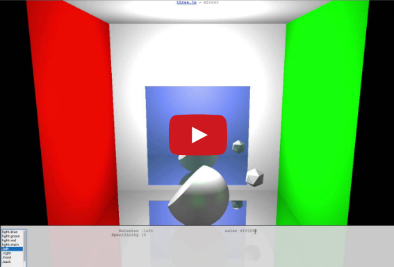

ThreeSS
=======

Centralized styling for THREE.js objects.  ThreeSS allows developers to style their THREE.js
objects in a similar fashion to CSS.


Build Status
------------

<table>
  <tr><td>Master</td><td><a href="http://travis-ci.org/Vannevartech/threess" target="_blank"></a></tr>
</table>


Demo
----
[](http://www.youtube.com/watch?v=uyTBIO45S8M)


Example Code
------------
```javascript
// Setup global styles (aka the stylesheet)
var style = new ThreeSS.StyleContext();
style.addRule('sphere', { material: 'meshLambert' });
style.addRule('.hot',   { color: 0xff4300, emissive: 0x440000 });
style.addRule('.cool',  { color: 0x3efffc, emissive: 0x102044 });

// Create some regular THREE objects with just dummy materials
var sphereGeom = new THREE.SphereGeometry(25, 10, 10),
    sphere = new THREE.Mesh(sphereGeom, new THREE.MeshBasicMaterial());

// Link the styles to the THREE objects
var sphereStyle = style.declareObject('sphere', 'hot');
sphereStyle.applyMaterialOnChange(sphere);

style.process();  // Ensure that all styles have propagated to THREE objects

// Now have fun playing with the sphere's style
sphereStyle.addClass('cool').removeClass('hot')
```

Examples
--------
You can play with the examples via rawgithub: [examples](http://rawgithub.com/Vannevartech/threess/master/examples/index.html)

You can also play with the examples that ship with ThreeSS by starting a simple webserver:

```bash
$ npm install
$ npm run examples
```
Point your web browser at http://localhost:7123/examples

The ThreeSS repository contains a couple examples from THREE.js that have been styled with
ThreeSS.  The examples are:
* webgl_geometry_shapes.html - Demonstrates basic styling including composition of selectors
* webgl_mirror.html - Demonstrates styling things with no material (such as lights or size of objects)

The examples make use of a style editor written using Angular.  The style editor is not part of
the core ThreeSS library and is only available under the examples directory.


Motivation
----------
Tuning the colors and styles of objects within a THREE scene can be a time consuming process.
The goal in creating ThreeSS was to centralize the styles into a single place (a stylesheet) and
allow developers to use CSS style rules (with selectors) to modify the attributes of materials and
objects.


Getting Started
---------------
Include the following scripts in your HTML:

```html
<script src="threess/lib/Slick.Finder.js"></script>
<script src="threess/lib/Slick.Parser.js"></script>
<script src="threess/threess.js"></script>
```

ThreeSS exports itself into the global context for now and can be accessed as in the above example.
The library makes use of Slick to parse and match CSS rules.


API Reference
-------------

### StyleContext
The StyleContext is the root of all operations done within ThreeSS.  It stores a cache of
materials and provides a mechanism for batching operations and cleaning things up when it's done.

```javascript
var styleCtx = new ThreeSS.StyleContext();
// ... do things that manipulate style rules and styles

styleCtx.process();  // apply the styles
```

#### Processing rule updates
Depending on what type of operation you are doing (changing the rules, or changing the object's
classes), you may need to re-apply rules.  This can be done by invoking the style context's
process method:

```javascript
styleCtx.process();
```


#### styleContext.declareRule()
ThreeSS rules are very similar to CSS rules.  Each rule contains two parts, a **selector** and a
**style**.

```javascript
// This rule selects all objects that are of type 'sphere'
styleCtx.declareRule('sphere', { material: 'meshLambert', color: 0xff0000 });

// For every sphere that has class 'big', this rule is applied, which overrides the above color.
styleCtx.declareRule('sphere.big', { color: 0xffffff });

// Classes can be used just like in CSS.  Here, any object that has a class 'green' gets green
styleCtx.declareRule('.green', { color: 0x00ff00 });

// If more classes are specified, the rule becomes more specific and a higher priority, as in CSS
styleCtx.declareRule('sphere.big.green', { color: 0x002200, emissive: 0x33cc33 });
```

The **style** associated with each rule contains attributes that match identically to the
properties set within each `THREE.Material`.  For instance:
```javascript
styleCtx.declareRule('sphere.shiny', {
    material:  'meshPhong',
    color:     0xcccccc,
    specular:  0xff00ff,
    shininess: 20,
    shading:   THREE.SmoothShading
    depthTest: false,
    wireframe: true
    /// ... etc
});
```

A **style** has only 1 special property, which is `material`.  This property defines which
`THREE.Material` to instantiate and assign the rest of the properties to.  Every object within
ThreeSS must be assigned a rule such that eventually it is assigned a material -- without this,
an error will be thrown.


### styleContext.declareObject()
An **object** is the thing against which **rules** are evaluated and applied.  You can think of
an **object** like an HTML element like a `<div/>` or a `<span/>`.

Objects contain 3 parts:

1. **Object Type** - this can be 'sphere', 'shape', etc.  This is similar to the HTML element type (div)
2. **Class List** - a list of classes associated with the object 'big juicy spicy'
3. **Object Style** - specific style attributes to assign to the object (like HTML's style=)

```javascript
// Declare an object of type 'sphere' that has 'big', 'juicy', and 'spicy' classes and always
// has a color of 0xff0000
var styledObj = styleCtx.declareObject('sphere', 'big juicy spicy', { color: 0xff0000 });

// Modify the styled object's classes
styledObj.removeClass('spicy').addClass('bland');
```

Once a StyledObject has been declared, its associated material can be used, assigning it to a
THREE.js object.
```javascript
var mySphere = new THREE.Mesh(new THREE.SphereGeometry(25, 10, 10), styledObj.material);
```

#### Dynamically updating an object's style
If the style is expected to change dynamically at runtime, you can configure the
styled object to apply a new material any time it changes:
```javascript
// Setup the sphere with a dummy material
var mySphere = new THREE.Mesh(new THREE.SphereGeometry(25, 10, 10), new THREE.MeshBasicMaterial());

// Every time the style for this object changes, update the material of the sphere
styledObj.applyMaterialOnChange(mySphere);
```

#### Styling lights or other objects
At its core, ThreeSS deals with `THREE.Material`s to represent the manifestation of a style.
However, sometimes things need to be styled that do not have a material (such as a light).  This
behaviour is somewhat supported in ThreeSS and shown in the webgl_mirror example.

```javascript
styleCtx.declareRule('light.bright', { material: 'meshBasic' /* ignored */, color: 0xdddddd });
styleCtx.declareRule('light.dim', { material: 'meshBasic' /* ignored */,    color: 0x444444 });
var styledObj = styleCtx.declareObject('light', 'bright');

var light = new THREE.PointLight( undefined, 1.5, 250 ); // Don't need a color here
// ...
scene.add(light);

style.declareObject('light', 'main').addMaterialChangeListener(function(material) {
    light.color = material.color;
});

styledObj.removeClass('bright').addClass('dim');
```

The above example demonstrates how to dynamically update the color of a light as its styling changes.


#### Styling based on non-material attributes
Sometimes it is useful to style things based on an attribute that does not live within any
`THREE.Material`.  An example of this is shown in the webgl_mirror example, where the small sphere
has its size dictated by the style.

To facilitate this, ThreeSS provides access to the computed style of a material as the `_style`
attribute of the material.

```javascript
styleCtx.declareRule('sphere.large', { material: 'meshBasic' /* ignored */, mySize: 200 });
// ...
style.declareObject('sphere', 'large').addMaterialChangeListener(function(material) {
    scene.remove(sphere);
    sphere = new THREE.Mesh(new THREE.SphereGeometry(material._style.mySize, 10, 10), material);
    scene.add(sphere);
});
```


Running the Tests
-----------------

Before running the test suite for the first time:

    $ npm install

To run the suite in phantomJS:

    $ npm test


Copyright
---------

Copyright 2014 the original author or authors

threess.js is made available under the MIT license.  See LICENSE.txt for details.


Change Log
----------

No releases yet
